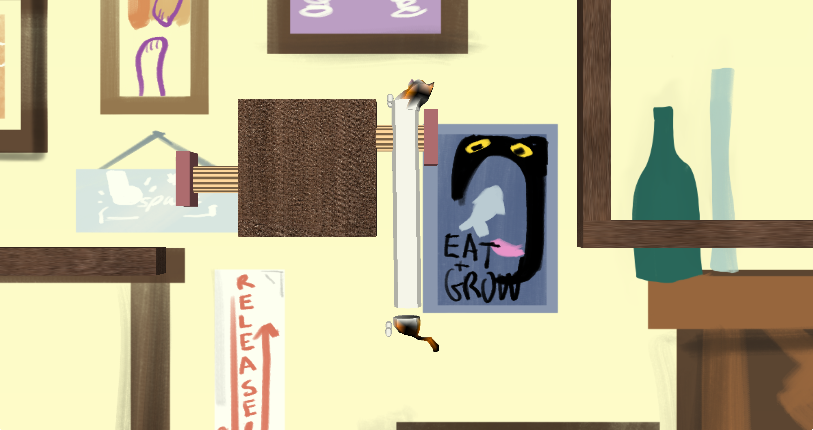

# FinalProject
15466 final project

## Screenshots

## Code
circle-line-segment intersection: https://stackoverflow.com/questions/1073336/circle-line-segment-collision-detection-algorithm

projecting a point onto a line segment: https://stackoverflow.com/questions/10301001/perpendicular-on-a-line-segment-from-a-given-point

random float generator: https://stackoverflow.com/questions/686353/random-float-number-generation

generate random point on a circle: https://stackoverflow.com/questions/9879258/how-can-i-generate-random-points-on-a-circles-circumference-in-javascript

## Asset
scenes/slinky.blend contains the game world, built with Blender.

In game music obtained from https://freepd.com/

SFX from https://freesound.org

Wood texture from https://unsplash.com/
